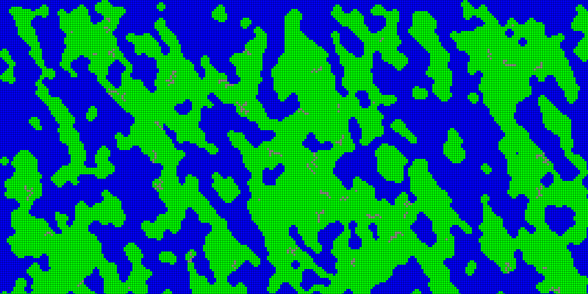

# Cellular Terrain Generator
### Procedural terrain generation using cellular automata principles.

When run, this application will generate a map of random terrain, currently comprised of three terrain types:
 - Water
 - Grass
 - Mountains
 
Once the generation script has run the user can then navigate the map and run some functions using key commands.
These are:

 | Key Name | Function |
 | -------- | -------- |
 | r key    | Regenerates the map using a new random seed |
 | up arrow key | Regenerates the map, with a higher chance for terrain to be grass |
 | down arrow key | Regenerates the map, with a lower chance for the terrain to be grass |
 | s key | Saves the whole map of the terrain to a png file called Map.png |
 | Click, hold and drag the map | View different areas of the terrain |
 | - key | Zoom the view out to see a larger area of the terrain |
 | = key | Zoom the view in to see a smaller area of the terrain |
 
 
## Requirements

To run the application with Python you will need:
- Python Version: 3.9 or greater
- Pygame Version: ~=2.0.1

A standalone exe version can be built using py2exe with version ~=0.10.4.0

## Starting the application
To start the application use the following command:
 `python .\cell_gen.py`

Optional arguments can be passed:
 - screen_width: Width of the display window
 - screen_height: Height of the display window
 - square_size: Size of a terrain square
 - land_chance: The chance that a terrain square will randomly start as a grass square. The higher this number, generally the proportion of grass to water will be larger.
 - Debug: If set to true, this will show each individual iteration of the cellular automata process refining the terrain. This does slow the application down a fair bit though on initial generation.
 
Example:
 `python .\cell_gen.py 1600 800 12 50 False`
 
## Sample Output

